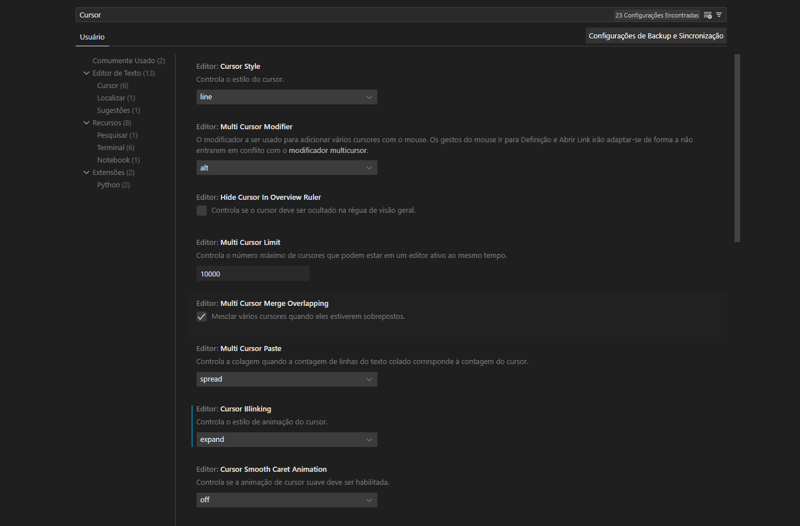
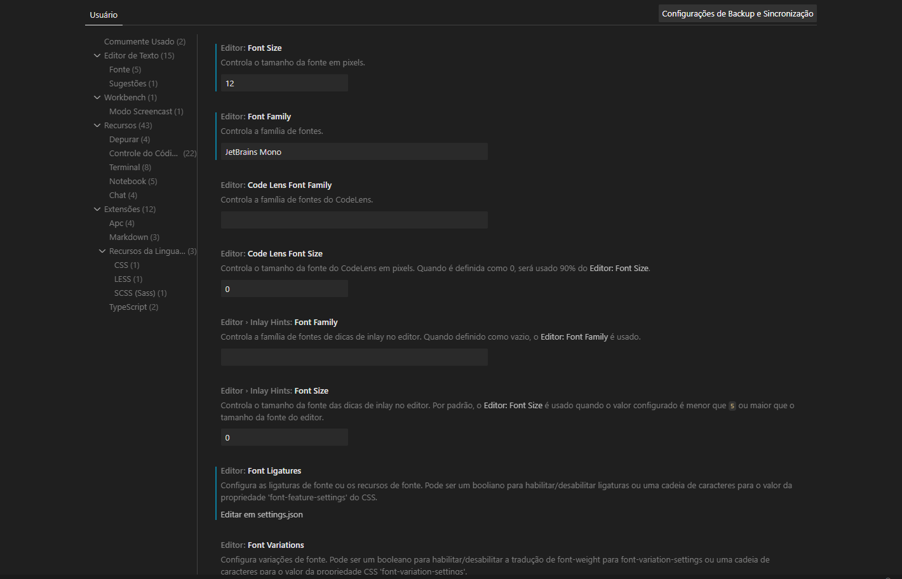

# Minhas configurações no VSCode

### Vídeo Tutorial:
Encontre o vídeo em : <a href="https://www.youtube.com/@Whisperingcode"> Whispering Code Channel</a>

# Configurações
Os prints abaixo são das minhas configurações de cursor e fonte.

Nas configurações do VSCode, pesquise por "Cursor" e Defina a animação do cursor para "Expand".

Já a minha fonte e a "JetBrains Mono" Font Family <a href="https://www.jetbrains.com/pt-br/"> Download aqui</a> em 12px size.

# Lista de Estensões

Aqui está a lista de extensões que estou usando atualmente (Conforme eu for mudando, irei sempre manter aqui atualizado):

<a href="https://github.com/mike7515/code-beautifier"> Beuatify</a>: Deixa o css, sass e menos código (extensão para Visual Studio Code).

<a href="https://github.com/kufii/CodeSnap"> CodeSnap</a> Usado na hora de fazer uma captura de tela do código.

<a href="https://github.com/usernamehw/vscode-error-lens"> Error Lens</a> Melhora o destaque de erros, avisos e outros diagnósticos de linguagem.

<a href="https://github.com/solnurkarim/HTML-to-CSS-autocompletion"> HTML to CSS autocompletion </a> fornece sugestões de preenchimento para classes e IDs de documentos de marcação para folhas de estilo.

<a href="https://github.com/MicrosoftDocs/intellicode"> IntelliCode</a> a extensão IntelliCode do Visual Studio fornece recursos de desenvolvimento assistido por IA para desenvolvedores Python, TypeScript/JavaScript e Java no Visual Studio Code, com insights baseados na compreensão do contexto do seu código combinado com aprendizado de máquina.

<a href="https://github.com/miguelsolorio/vscode-symbols"> Symbols</a> ícones para o Visual Studio Code (ícones de arquivos).

# Minhas Extensões Live Code

<a href="https://github.com/ritwickdey/vscode-live-server"> Live Server</a>

<a href="https://github.com/microsoft/vscode-livepreview"> Live Preview</a>

<a href="https://github.com/microsoft/live-share"> Live Share</a>

## Meus Temas

As vezes eu uso o <a href="https://github.com/hikarin522/GlassIt-VSC"> Glassit-VSC </a> para deixar o VSCode transparente em todos os meus tema.

## Aqui Está minha lista de temas.

1- <a href="https://github.com/sadra1f/minimal-dark-vscode-theme"> Minimal Dark </a> 
2- <a href="https://github.com/primer/github-vscode-theme"> GitHub theme </a> 
3- <a href="https://github.com/Monokai/monokai-pro-vscode"> MonoKai</a> 

# Agradecimentos

Se você chegou ate aqui e gostou de como ficou o seu VSCode, peço que clique em Star + e dê um Follow no meu Git Hub e no meu canal que estou começando. <a href="https://www.youtube.com/@Whisperingcode"> Whispering Code</a> 
